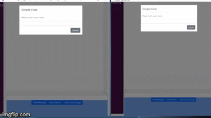

# reactChat

Client server application in where we the user sees all the podcasts.



## to get the repo:

```
git clone https://github.com/jolaya182/reactChat.git

```

To install:
```
npm  i
```

To run the server:
```
npm run server
```

To run a production build:
```
npm run build
```

Finally go to the src folder: `reactPodcast`
open the `dist` folder and click on the `index.html` file

OR

To work in development mode, type:

Start the dev server:
```
npm start
```
Finally, open your webbrowser and type in this url: `http://localhost:8080/` 